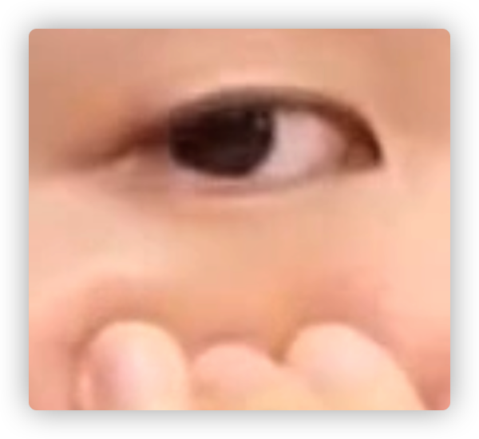
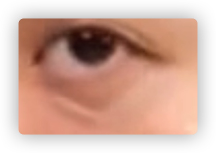

#  底妆

- 少量多次

## 底妆的目的

- 肤色均匀，健康光泽，提升气色（不是追求白和零瑕疵，妆感过厚）(不能和脖子有明显色差)

- 皮肤素颜是不均匀的，皮肤底层色素分布不均匀

  - 一般：

    前额颜色深

    眼周围发黑发青

    面颊鼻头偏红

    嘴周围偏黄

    下巴偏绿

- 底妆优缺：

  遮盖**平面**瑕疵（立体痘痘无能）

  褶皱：凹陷用亮色（效果有限）

  毛孔粗大：局部使用，少用（阿玛尼的隐形画布，benefit的反恐精英）

## 底妆的步骤

- 根据皮肤选择性操作

### 1_妆前保湿

- 不是日常护理（为了底妆清透服帖，越水润越好）

- 敷面膜10-15分，然后清理掉多余的精华液，否则会搓泥

- 有喷头爽肤水，远离喷，手按压，可以重复步骤

  爽肤水，乳液等质地稀薄的护肤品（一般就用这个），皮肤快速吸收就不影响后面的妆效；

  厚重的膏霜，眼霜，吸收较慢

  吸收完毕（否则搓泥脱妆），按摩可以帮助吸收，摸上去凉凉的就行

- 外油内干或角质层厚，不好吸收护肤品时：去角质的面膜 或 软化角质的爽肤水 或 热水敷脸

### 2_特殊问题处理

- 妆前乳（非必需，大部分人都可以跳过）

### 需要妆前乳的人

- 使用互补色

- 点在额头、鼻尖、下巴、脸部，点按铺开（少量多次）

- 皮肤**黄**用**紫色**妆前乳

  1）皮肤大面积肉眼可见的暗黄（脸比脖子黄）

  2）额头下巴明显暗黄，局部使用妆前乳

- 皮肤**红**（血丝等）用**绿色**妆前乳

  大面积发红用，局部后面用遮瑕

- 油性区域

  控油妆前 SOFINA的控油妆前

  出油厉害的地方局部使用

- 毛孔粗大问题

### 3_局部的遮瑕

### 要点

1）最好使用遮瑕刷，纤维毛，毛质光滑有弹性

2）少量多次，可以将有颜色的遮瑕膏与粉底液在手背上混合后使用

3）不要推开，注意遮瑕边缘的过渡

### 红色瑕疵

红色痘印，鼻翼，绿色遮瑕膏

1）取稍深的遮瑕膏在手背上

2）与绿色的遮瑕膏与之混合（可选，方便调色）

3）蘸取一点，点按局部上妆

4）用手把不自然的周边晕染

### 眼周

- 判断类型：

  仰头

  手指放在目标区域下，往上推起（把凹陷部分向上凸起）

  

  - 很多人都不止一种类型：

    色素型：区域暗沉

    血管型：毛细血管

    结构型：黑色消失

- 深色遮瑕膏混合橙色遮瑕膏（除了靠近眼睛为了画卧蚕以外全部覆盖，点涂）
- 偏粉的浅色遮瑕提亮

- 前两种类型 （除了靠近眼睛为了画卧蚕以外全部覆盖，点涂）
- 结构型（边缘处勾线，由**向内**点涂晕染）

- 手指均匀边缘

### 斑或痣

（皮肤深色瑕疵）

- 先用深色遮瑕再用浅色遮瑕（靠近发际线皮肤深的话就不用浅色提亮）

- 点按

  手指晕开边缘

## 4_粉底

### 选择粉底

- 偏油皮肤，液态粉底液
- 偏干皮肤，膏霜状粉底
- 固态很干的用作遮瑕

### 步骤

- 海绵打湿后捏干
- 脸上点五个点：额头，鼻尖，下巴，眼部下方（靠面部中心）
- 用海绵按压之后提开，从中间向四周
- 粉多了就拿另一面抹走

## 4_定妆

- 无色透明粉
- 粉饼，散粉都可以用粉扑或刷子
- T区，唇周，眼周（出油多）
- 刷子蘸取，拍掉浮粉
