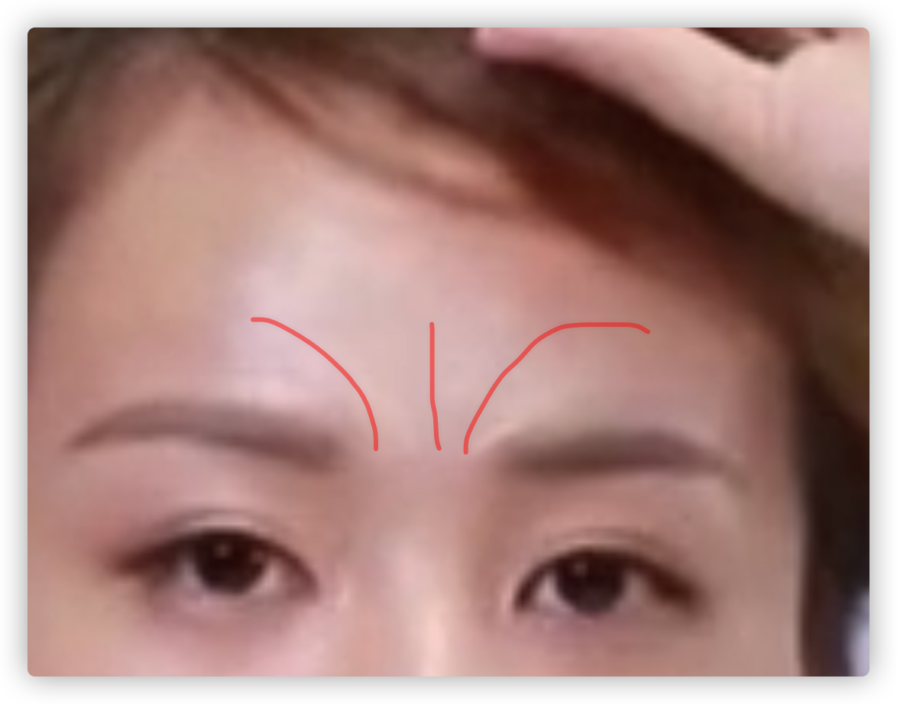

 

# 立体脸型矫正术

## 基本原理

- 四高三低
- 以皮肤为基地色
- 粉质修容盘(大范围不建议，高光暗影大刷子定妆)，遮瑕，粉底液（推荐）

## 高光色

### 额头

- 眉心向发际线

- 太阳穴凹陷的话，在眉尾使用高光

### 鼻梁

- 山根凹陷
- 浅色遮瑕膏，无珠光高光粉

- 眼睛中间点高光，用小点刷子（鼻梁不宽）

- 中庭短：打过鼻尖

  中庭长：鼻尖之前

### 唇珠

- 人中长：

  唇膏：上唇外扩

- 人中手指一点，往外扩

### 下巴

- 下巴短：下巴尖高光

  下巴长：下唇凹陷

- 第一笔中间，半弧形往外扩

### 眼部下方

- 第一笔眼部正下方，向外延伸

- 中庭短：下面延伸多（鼻底以下）

  中庭长：下面延伸少

- 脸宽：向两边延伸少

  脸窄 ：向两边延伸多

### 法令纹

### 眉骨

- 肿眼泡就不用了

## 阴影色

### 发际线

- 从中间往两边、往下，往下多少取决于上庭长短

### 颧骨

- 让脸看起来瘦
- 由外向内

- 定妆：遮瑕粉

  不超过鼻子下面

   

  

  

### 鼻侧

- 小刷子 

其他线用刷子余粉带一带

## 定妆

- 普通定妆粉过度高光与阴影：局部（鼻子用小刷子）

## 腮红

- 膏状质地（推荐），粉状质地

- 打圈方式上妆，边缘向外延展

- 平拉（拉宽脸）

  斜向上（拉长脸型，圆脸，宽脸，塑造形状）

  团状（苹果肌）

