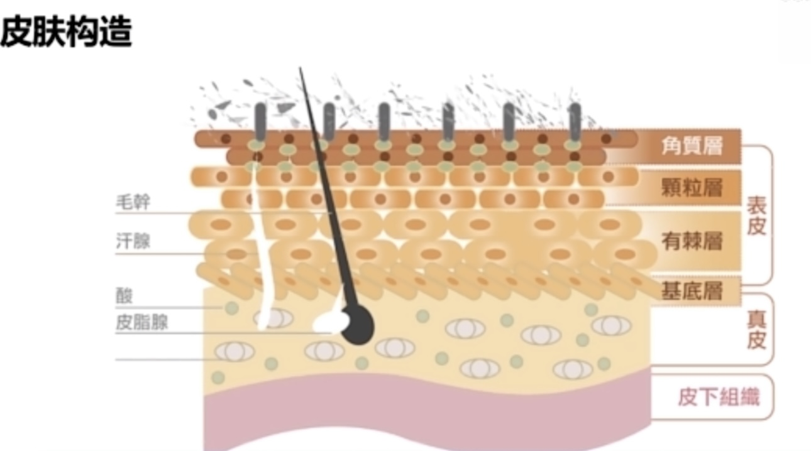
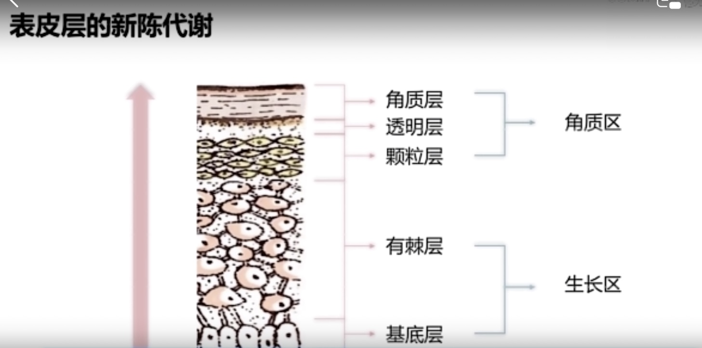
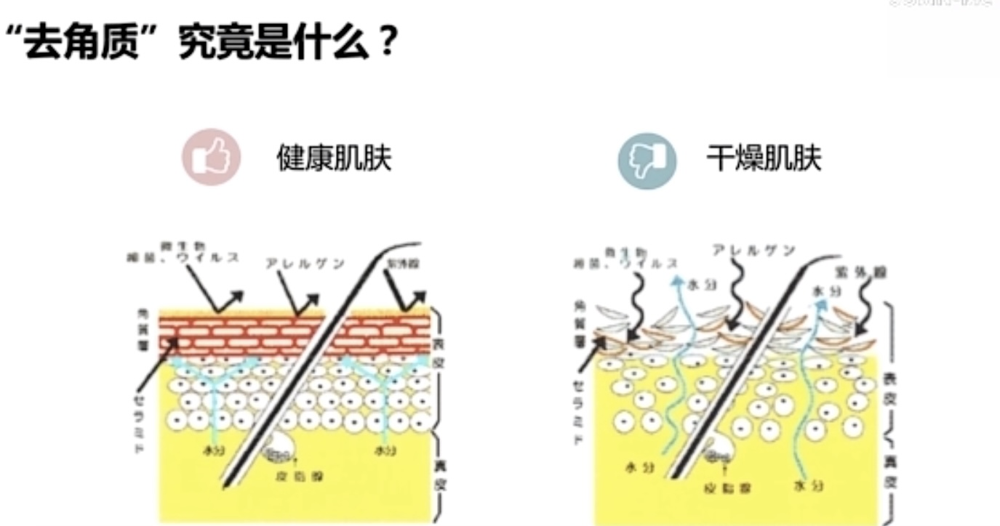
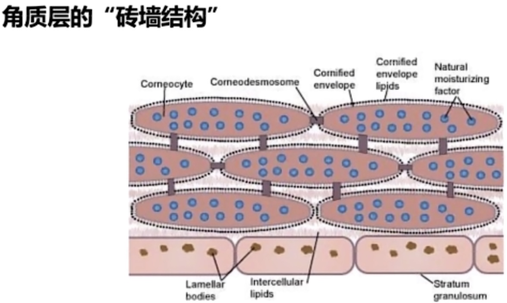
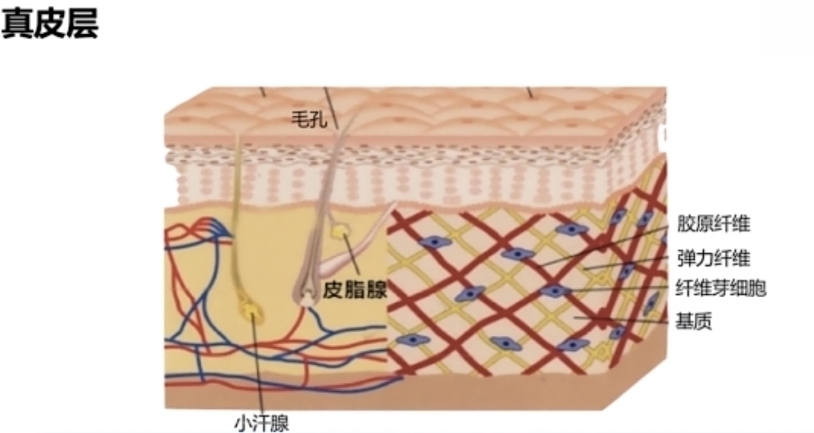
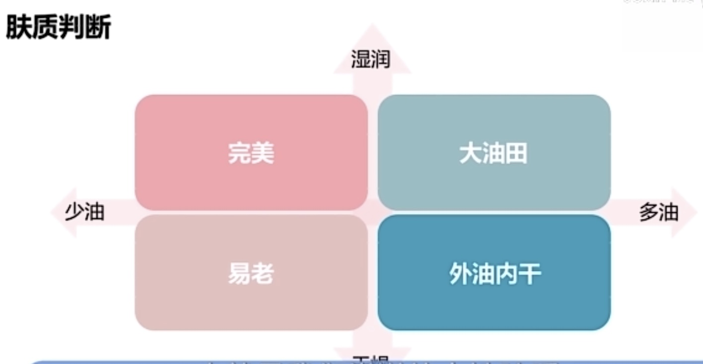

> 良好的护肤习惯有时
> 比昂贵的护肤品更有用，很多按摩器类可以直接用手按摩代替

# 皮肤构造

- 皮肤周期：1-2个月

## 表皮层

### 基底层

- （表皮层里）：生成黑色素（随着周期向表层移动)

### 角质层（表皮层里)

- 角质会自己脱落，可以不用去角质，按需去角质
- 水油平衡：
  砖墙结构：水泥有：NMF，神经酰胺，角鲨烷，角鲨烯，游离脂肪酸等
  皮脂膜（角质层表面)防止水分蒸发；年龄增大，皮脂变少

## 真皮层

- 外用无法补充胶原蛋白（大分子无法直接进入），口服能否补充胶原蛋白不确定
- 预防胶原蛋白流失做好防晒（减少细胞损伤）
- 外用护肤品只能进入表皮层和真皮层的表层
- 表皮层有血管神经（小心医美)

# 健康皮肤

- 油脂分泌正常，砖墙结构水分充足，角质层脱落正常
- 中性肤质最好（不要折腾)

# 三大法宝
- 清洁，保湿，防晒（防止皮肤损伤，损伤部分细胞不可逆）
- 更进一步：抗老，美白，修复
- 护肤适量，过度护理导致敏感肌，不要一味追求好吸收，好渗透

# 选购指南

## 清洁

- 温和类洁面
  旁氏米粹，大宝，丝塔芙，珂润，freeplus，清妃柔白
- 少用洗脸刷，会破坏皮脂膜
- 25+：谨慎皂基洁面

## 专门去角质

- 果酸，水杨酸洁面产品，肌研，卵肌

## 保湿

- 油脂，水，乳化剂
  常见保湿成分：NMF（天然保湿因子），尿素，乳糖酸，氨基酸，玻尿酸（透明质酸）
  常见封闭性成分：脂肪酸，植物性油脂，动物性油脂，凡士林
- 肌研极润，MUJI高保湿，珂润，契尔氏，伊丽莎白雅顿（推荐）
- app挑选产品：美丽修行，肌密，你今天真好看

## 防晒

- 紫外线：长波UVA（常年，阴影也有），短波UVB（晒伤）
  防长波（PA），防短波（SPF）
- 购买选择两个都有的，使用量充足（脸部一枚硬币）
- 带妆补涂防晒选喷雾型防晒
- 敏感肌，痘痘物理防晒
- 日常15-30倍
  外出50倍
- 多种防晒方式使用
- 安耐晒，ALLIE，SOFINA，资生堂
