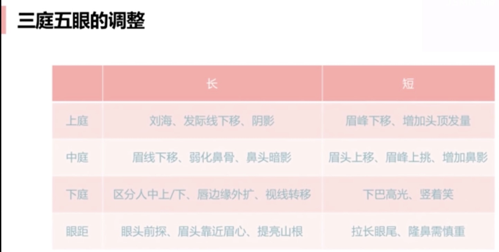

# 自我认知
光线充足，拍正面，露肩颈

比例比脸型更重要

# 轮廓分析

## 长宽比

- 长宽比（标准1:0.618黄金矩阵），用标准的椭圆框一下自己的脸型

- 越靠近黄金矩阵，脸型越长
  越靠近1:1，脸型越宽
  
- 偏宽：挑高眉峰，斜拉腮红，纵向高光

  偏长：额头下巴加暗影，横向腮红，平拉眉形 

## 找到最宽处（确定脸型）

哪里宽哪里打阴影

## 辨认直曲

- 颧骨，下颚骨
  曲线多：温柔
  直线多：坚毅，气场类

# 比例分析
## 三庭五脸

- 三庭：长度比例
  前发际线，眉线，鼻底线，下巴三等分最好
  五眼：宽度比例
  眼睛长度为标准（五等分)，两眼内眼角之间一只眼睛的长度最好
- 矫正妆是一切妆容的基础：均衡，强调
  过分的遮盖会弄巧成拙，使用强调转移对缺点的注意

- 上庭过长：刘海，发际线下移，阴影
  上庭过短，眉峰下移，增加头顶发量
  中庭，鼻子长度（鼻尖到眉头），中庭过长，眉线拉平
  中庭过短：加长鼻线，鼻影增加
  下庭短：加高上唇唇线；竖着笑增加下巴线条，增加下巴存在感
  下庭长：增加下唇厚度，光泽唇膏；
- 宽眼距：无辜，慵懒；加长眼头，增加鼻影，眉头提前																							    
- 窄眼距：女王范；拉长眼尾增加眼距

# 面部对称性

- 难自知

- 拍照，镜面对比

- 生活习惯（单边侧睡，单边咀嚼），表情习惯（单挑眉）

- 重点调整眼睛不对称：

- 双眼皮的褶皱（眼线粗细）

  - 眼线长短弧度
  - 眼皮弧度
  - 眼睛圆，长度
  - 眼头，眼尾弧度
  - 眼尾上翘角度

- 素颜时一个小小的特点，会在化妆的作用下被强化放大

- 按摩：消除肌肉紧张，缓解不对称问题

  娇韵诗按摩视频

  用手就行，可以不用美容仪

