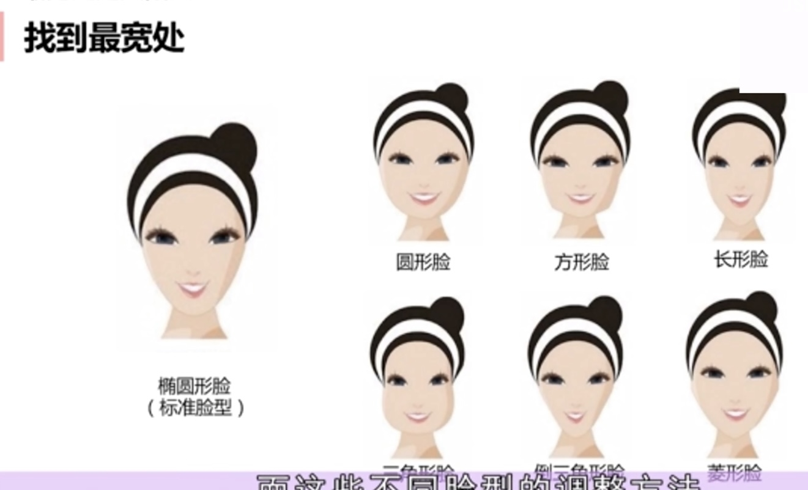
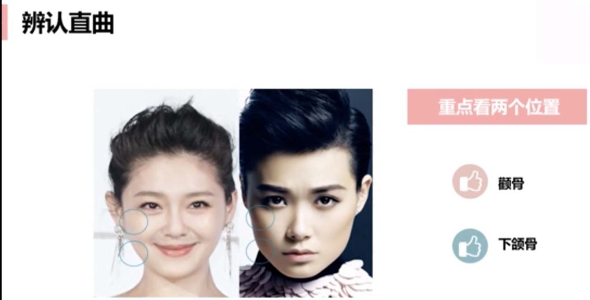
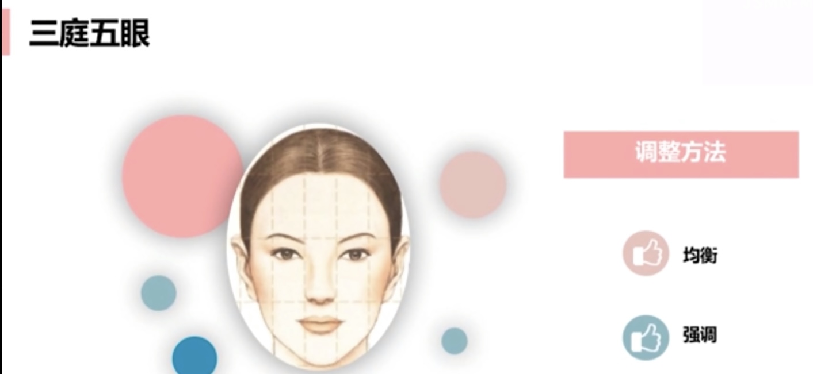

# 自我认知
光线充足，拍正面，露肩颈

# 轮廓分析
长宽比（标准1:0.618黄金矩阵），用标准的椭圆框一下自己的脸型
越靠近黄金矩阵，脸型越长
越靠近1:1，脸型越宽

找到最宽处（确定脸型）
哪里宽哪里打阴影

辨认直曲
颧骨，下颚骨
曲线多：温柔
直线多：坚毅，气场类

# 比例分析
三庭五脸
三庭：长度比例
前发际线，眉线，鼻底线，下巴三等分最好
五眼：宽度比例
眼睛长度为标准（五等分)，两眼内眼角之间一只眼睛的长度最好

矫正妆是一切妆容的基础：均衡，强调
过分的遮盖会弄巧成拙，使用强调转移对缺点的注意
上庭过长：刘海，发际线下移，阴影
上庭过短，眉峰下移，增加头顶发量
中庭，鼻子长度（鼻尖到眉头），中庭过长，眉线拉平
中庭过短：加长鼻线，鼻影增加
下庭短：加高上唇唇线；竖着笑增加下巴线条，增加下巴存在感
下庭长：增加下唇厚度，光泽唇膏；

宽眼距：无辜，慵懒；加长眼头，增加鼻影，眉头提前

