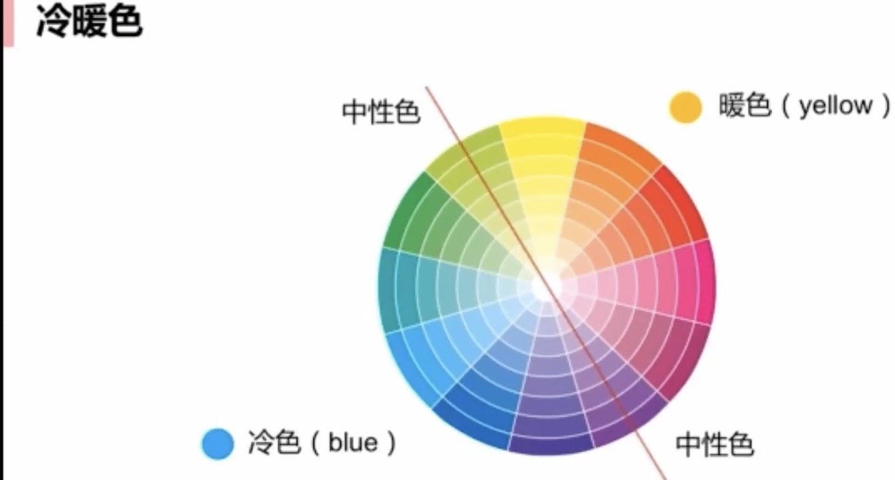
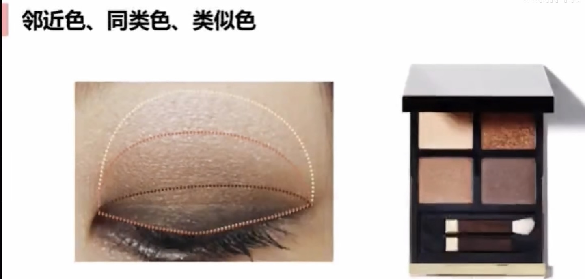
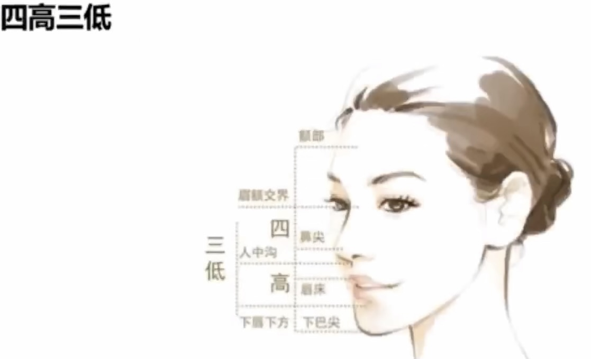
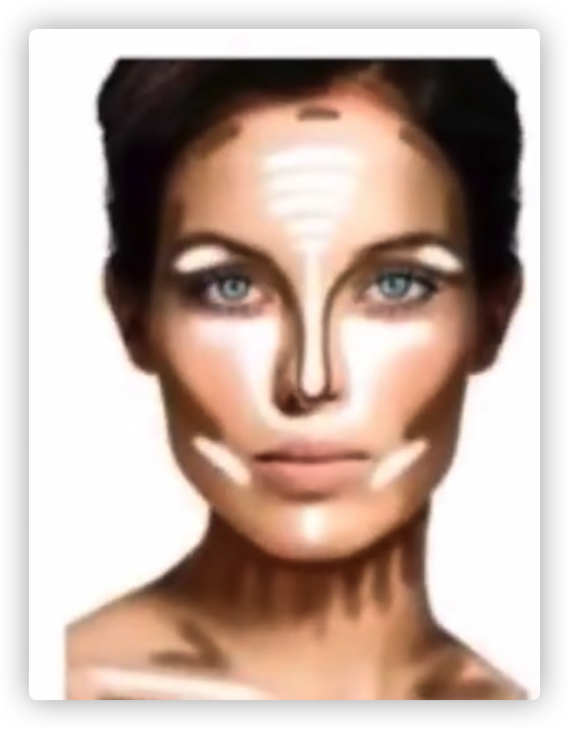
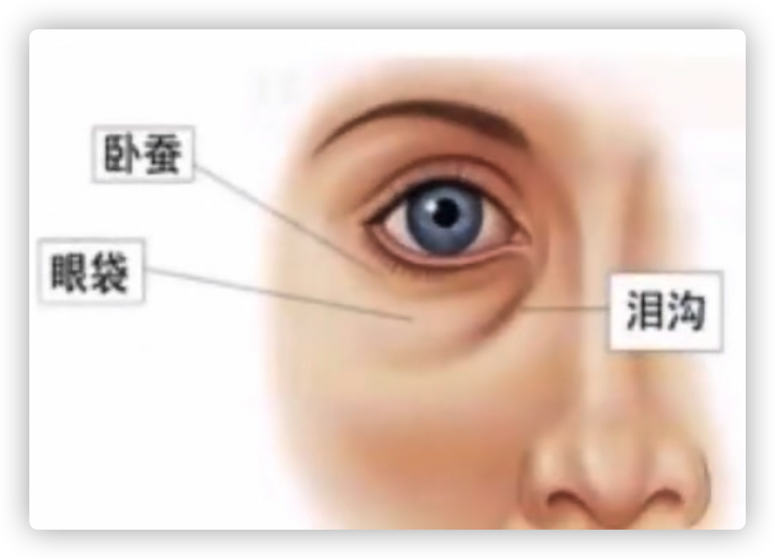
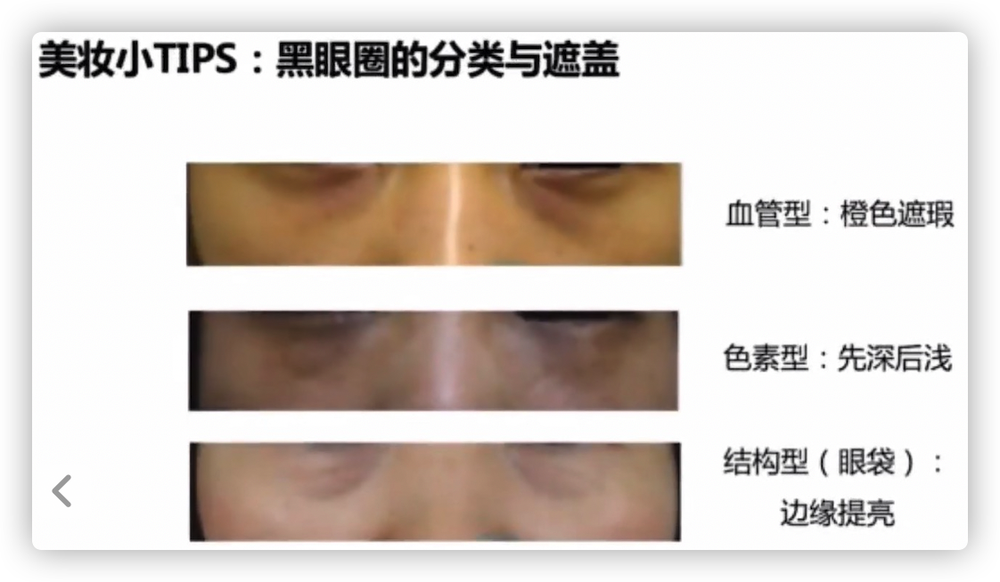

# 色彩和明暗

## 色彩原理

- 三原色：红黄蓝

  三间色：橙绿紫

- 颜色环里面，相距角度越大的颜色，日常越少用

### 互补色

- 颜色环相差180度

  - 紫色黄色互补色，紫色妆前乳调和明显黄色皮肤

  - 绿色红色互补色，绿色妆前乳调和明显泛红皮肤

  - 橙色蓝色互补色，橙色遮瑕膏遮盖蓝紫色血管+浅色提亮

### 冷暖色

- 黄绿色，紫红色是中性色

  中性色把颜色环一分为二，一边暖色，一边冷色

- 底妆颜色，妆容主色调的一致性（眼影，腮红，唇膏）

  不同明度同色调色彩

- 唇膏：偏红还是偏黄（橘黄色/粉紫色）

### 邻近色

- 三色眼影盘
  - 靠近眼线用最深色
  - 最浅色：打底色（无珠光），提亮色（有珠光）
  - 中间色用作过渡色

- 四色眼影盘：
  - 选出最深最浅色，中间色二选一
  - 珠光色在眼珠上下，增加亮度

- 更多颜色眼影盘：同上

## 明暗表现

- 塑造立体感

### 四高三低

- 四高：高光

  额头：靠近眉心越高，想发际线延伸

  鼻头鼻梁高光：哑光的膏状高光，或浅色遮瑕膏

  唇珠高光

  下巴尖：下庭长可以不打高光，或打得靠上

- 三低：阴影

### 常见阴影

颧骨的下方和下颚骨（以瘦为美的主流），可爱风不用

- 高光阴影：相对肤色来说

- 之前买的不适合的粉底可以当作修容用

### 泪沟眼袋眼圈

- 血管型：作息，用眼问题，热敷

- 色素型：防晒， 卸妆不充分

- 结构型：天生，时间

  泪沟遮盖用高光（凹陷边缘）

## 审美总结

- 整体和谐，统一风格
- 面部任何特点没有优缺而言，看我们想要的表现风格